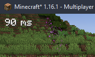

# LatencyMod

A simple mod that shows the latency (ping) of your minecraft client to the server you're currently playing on.

## Roadmap
Check [github projects](https://github.com/N3ROO/LatencyMod/projects)

## Contributing
Don't hesitate to contribute. Even if it's your first time, it's never too late to learn!

If you want to contribute, make sure to:
- Try to follow the [Google Java Style Guide](https://google.github.io/styleguide/javaguide.html), but the column limit is 120 and not 100.
- Make sure that your commits are clear enough to understand what changed
I will most likely accept your pull request even if it's just a typo fix! :)

## Credits & Acknowledgements

- [@N3ROO](https://github.com/N3ROO)  - *Main developer*
